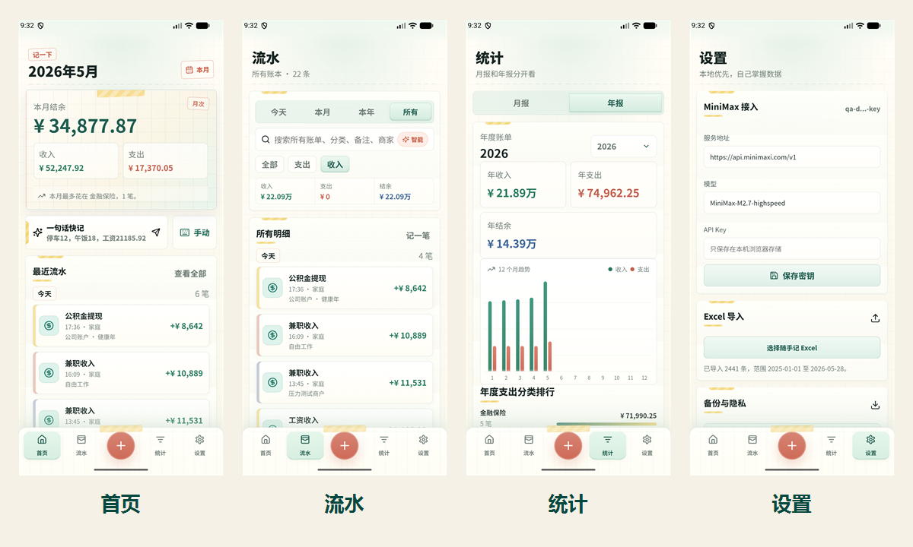

# 记一下

> 本地优先的 Android 日常流水账 App，支持一句话 AI 快记、随手记 Excel 导入、账本检索、月度/年度统计和 JSON 备份。



## 简介

记一下是一个面向个人和家庭日常消费记录的移动端记账工具。它的目标不是做复杂的资产负债系统，而是把“今天花了什么、这个月钱去哪了、今年收入支出怎样”这几件事做轻、做快、做清楚。

V1 使用 React + TypeScript + Vite + Capacitor 构建 Android App，数据默认保存在本机。AI 功能采用“先生成草稿、再由用户确认”的方式：模型只接收本次输入和分类字典，不会上传历史流水。

## 功能特性

- 一句话快记：例如“停车12，午饭18”可拆成多条待确认草稿。
- 流水账本：支持今天、本月、本年、所有四个周期切换，并可按关键词搜索账单。
- AI 辅助搜索：当搜索词和账单字段不完全一致时，辅助找出相近记录。
- 分类体系：基于历史账本习惯整理支出、收入及二级分类。
- 统计分析：提供月度概览、年度趋势、分类排行和收入来源排行。
- Excel 导入：支持导入随手记风格的支出/收入工作表。
- 本地备份：支持 JSON 备份和恢复，便于迁移或自留存档。
- Android 适配：界面按手机端优先设计，兼顾状态栏、安全区和挖孔屏。

## 技术栈

- React 18
- TypeScript
- Vite
- Capacitor 7
- Zustand
- Recharts
- Vitest
- MiniMax / OpenAI-compatible chat completions API

## 快速开始

```bash
npm install
npm run dev
```

本地开发服务启动后，可以在浏览器中预览 Web 版本。Android 真机或模拟器调试请先构建并同步 Capacitor。

## Android 构建

```bash
npm run build
npx cap sync android
```

随后可以用 Android Studio 打开 `android/` 目录进行安装、调试和打包。

## AI 配置

默认模型配置面向 MiniMax 的 OpenAI-compatible 接口：

- Base URL: `https://api.minimaxi.com/v1`
- Endpoint: `/chat/completions`
- Model: `MiniMax-M2.7-highspeed`

API Key 请在 App 设置页保存到本机安全存储，不要提交到仓库。AI 快记失败、网络失败或返回 JSON 不合法时，不会直接写入正式流水。

## 数据与隐私

- 历史流水、导入 Excel 和 JSON 备份均由用户本地管理。
- AI 请求只包含“本次输入 + 分类字典”，不包含历史账本明细。
- AI 解析结果会先进入草稿，确认后才会转为正式流水。
- 统计只基于正式流水，草稿不会计入月度或年度统计。

## 项目结构

```text
src/
  App.tsx              # 主界面与交互
  store.ts             # 本地状态与持久化
  data/categories.ts   # 默认分类
  lib/                 # AI、导入、统计、搜索、备份等核心逻辑
android/               # Capacitor Android 工程
docs/images/           # README 与文档图片
qa/                    # Android 和 WebView 验证脚本
```

## 验证

```bash
npm run check
npm test
npm run build
npx cap sync android
```

当前测试覆盖 Excel 导入、金额解析、AI 草稿解析、账本搜索、月度/年度统计和压力样例。

## 贡献

欢迎围绕移动端体验、记账分类、统计视图、导入兼容性和本地隐私增强提交 issue 或 pull request。提交前请尽量运行 `npm run check` 和 `npm test`。

## 开源协议

本项目基于 [MIT License](LICENSE) 开源。
